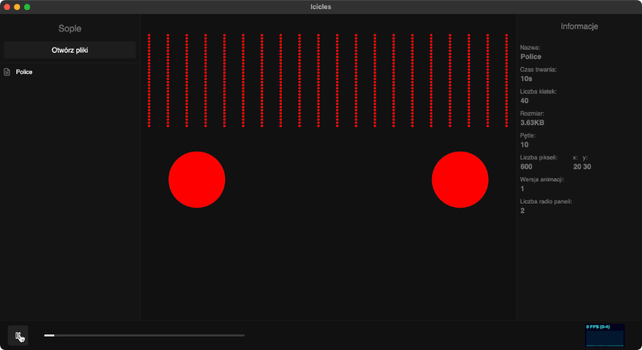

# Icicles animation template

## Requirements:
- **Installed Dart SDK** - If you don't have the Dart SDK installed, take a look at the following page: [https://dart.dev/get-dart](https://dart.dev/get-dart).  
    Dart is the programming language in which the animation generator is written. There is also a version of the generator in JavaScript, but it is much slower and outdated.
- **Visual Studio Code (IDE)** - Download and install the VSCode from the following URL: [https://code.visualstudio.com/download](https://code.visualstudio.com/download)

## How to start?

1. Open this project in VSCode.
2. Implement the animation in the `bin/animation.dart` file.
3. Generate an animation
   - by running `dart run bin/animation.dart` in the console.  
   - or compile the generator by running `dart compile exe bin/animation.dart` and then run the compiled file.

### Warning ⚠️
Make sure you don't exceed **30FPS**, as the controller may not be able to display your animation properly.   
The framerate of 60FPS is the upper maximum, which *should* work as well, but is **not recommended** - in case the controller doesn't support the speed you passed it will play the animation at the maximum possible speed supported by the platform.

## Example
In the `bin/animation.dart` file you can find the example animation implementation, that looks as follows: 

## Documentation
Documentation of icicles_animation_dart can be found in the **[README](https://github.com/led-icicles/icicles_animation_dart#readme)** file.